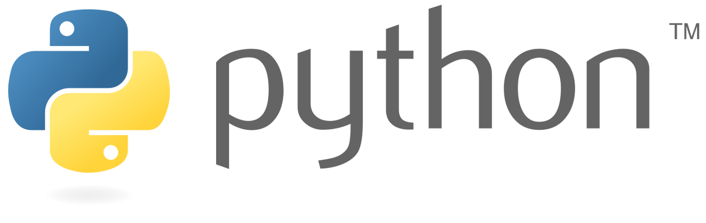
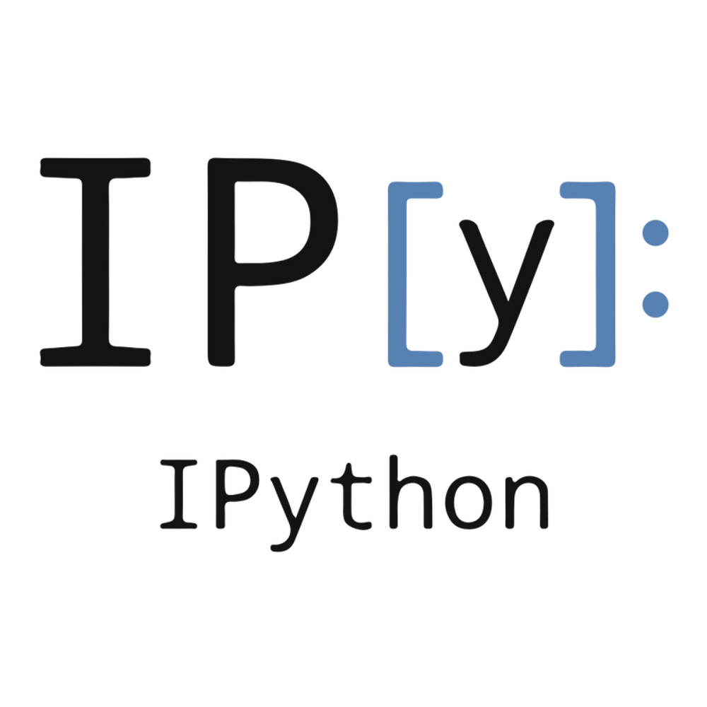
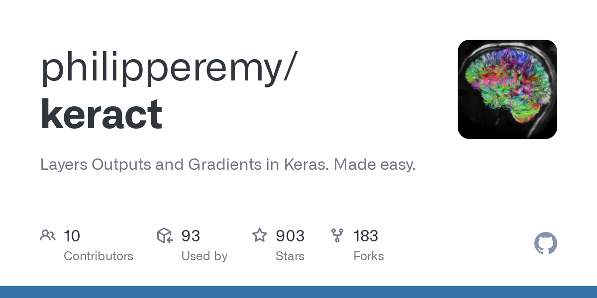

# [Link to my Youtube Video Explaining this whole Notebook](https://www.youtube.com/watch?v=q6E8kGbpaMI&list=PLxqBkZuBynVRyOJs4RWmB_fKlOVe5S8CR&index=27)

### Author: Rohan Paul

#### Find me here..

- 🐦 TWITTER: https://twitter.com/rohanpaul_ai
- ​👨‍🔧​ Kaggle: https://www.kaggle.com/paulrohan2020
- 👨🏻‍💼 LINKEDIN: https://www.linkedin.com/in/rohan-paul-b27285129/
- 👨‍💻 GITHUB: https://github.com/rohan-paul
- 🤖: My Website and Blog: https://rohan-paul-ai.netlify.app/
- 🧑‍🦰 Facebook Page: https://www.facebook.com/Computer-Vision-with-Rohan-Paul-109348958325690
- 📸 Instagram: https://www.instagram.com/rohan_paul_2020/

---

## Tech Stack

|<a href="https://www.python.org/">

</a>|<a href="https://jupyter.org/">

</a>|<a href="https://ipython.org/">

</a>|<a href="https://numpy.org/">

</a>|<a href="https://pandas.pydata.org/">

</a>|
|---|---|---|---|---|

|<a href="https://matplotlib.org/">

</a>|<a href="https://opencv.org/">

</a>|<a href="https://albumentations.ai/">

</a>|<a href="https://keras.io/">

</a>|<a href="https://www.tensorflow.org/">

</a>|<a href="https://github.com/philipperemy/keract">

</a>|
|---|---|---|---|---|---|

